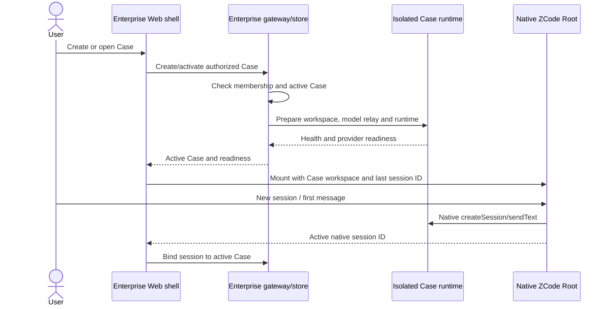

# Enterprise workspace UX design

## Problem and source evidence

The current enterprise screen puts Tenant, ServiceSpace, ServiceObject and Case creation forms beside ZCode's native workspace. A successful Case activation mounts `Root`, but the native startup provider guard can replace the workspace with `WelcomeScreen`. Each Case runtime has a separate HOME directory, so a model connection saved through native onboarding in one Case is not available in another. The result is a technically activated Case without a dependable path to chat.

The existing implementation is in `packages/web/src/enterprise/EnterpriseApp.tsx` and `EnterpriseNativeRoot.tsx`. `packages/ui/src/Root.tsx` owns the native provider gate and initial workspace/session selection. `packages/ui/src/TaskList.tsx` starts a draft when the user chooses a new session; the first message creates the native session. `packages/enterprise/src/runtime.ts` creates the isolated per-Case HOME. The enterprise gateway owns authorization and active Case selection.

## Product model and labels

| Concept | User meaning | Owner | Relationship |
| --- | --- | --- | --- |
| Tenant | Organization and access boundary | Enterprise control plane | Contains ServiceSpaces and model connection policy |
| ServiceSpace | Business grouping, such as a client team | Enterprise control plane | Contains ServiceObjects and Cases; not a native ZCode workspace |
| ServiceObject | Customer, product, asset or other subject | Enterprise control plane | A Case captures an immutable snapshot |
| Case | A piece of work for a ServiceObject | Enterprise control plane | Owns one isolated native workspace directory and runtime |
| Session | A conversation within a Case | Native ZCode | Many sessions per Case; draft becomes a session on first send |

The UI calls a Case a “案例” and explains once during creation that it opens an independent ZCode work area. It does not label ServiceSpace or ServiceObject as a ZCode workspace. “新建会话” retains ZCode's native meaning.

## Chosen interaction structure

Use an enterprise home before a Case is open, and a nearly full-screen native ZCode workspace after opening one. Do not retain the business administration form column beside chat. An enterprise top bar supplies Tenant, ServiceSpace and Case navigation; the native sidebar owns sessions, and the native Composer owns sending, modes and tools. Keep `allowOpenWorkspace=false` inside a Case so the user cannot select a directory outside the authorized Case.

Two alternatives were considered:

1. Keep the current permanent business sidebar and improve its forms. This preserves code but leaves two competing navigation systems and a narrow chat pane.
2. **Selected:** Enterprise home and Case switcher around a full native workspace. This uses the current control-plane/runtime boundary and follows ZCode's project/session interaction.
3. Embed Cases directly into ZCode's native workspace tree. This could feel more unified, but would substantially couple enterprise authorization and navigation to upstream UI internals.

### Screen A: enterprise home

After enterprise sign-in, show the tenant and a list of recent/open Cases grouped or filtered by ServiceSpace. The primary action is “新建案例”. ServiceObjects are searchable in the creation flow; routine ServiceSpace and ServiceObject management is available from a secondary management page or dialog. Empty states explain the next action. Returning to home never closes a Case by itself.

### Screen B: create Case dialog

The dialog has one short flow: choose ServiceSpace, choose or create ServiceObject inline, enter Case title, and optionally choose a category. Category is optional in the store and defaults to `general`; the UI should match that contract. Show the immutable ServiceObject snapshot rule near creation. The primary action is “创建并打开案例”. Do not create a native session yet.

Successful submission creates the Case and its server-controlled workspace, activates it, prepares the runtime, and opens native ZCode in a draft conversation. Failure leaves the dialog open with the entered values and a specific error. Repeated submission while pending is disabled.

### Screen C: Case workspace

```text
Enterprise top bar:  Tenant / ServiceSpace / Case ▾     + 新建案例     模型状态     账号
┌──────────────────────────────────────────────────────────────────────┐
│ Native ZCode: sessions sidebar │ Composer / chat │ file / tool panes │
└──────────────────────────────────────────────────────────────────────┘
```

The top bar remains compact. Its Case switcher offers recent Cases and “所有案例”; it never displays another tenant's Case. The selected Case's title, ServiceObject and status are visible in the switcher or a compact context panel. Business details and status changes live in a Case details drawer, not in the chat header's primary path. Native “新建会话” starts a draft within the current Case. The first message creates the session; subsequent sessions appear in the native session list. Opening a Case restores its last bound session, or a draft if none exists.

Switching Case first unmounts the old native Root and closes its socket, then activates the new authorized Case and mounts a fresh Root. A nonempty unsent draft prompts before switching; an empty draft does not. Tenant switching uses the same teardown. Failed activation leaves the user on home or a retryable transition screen, never on a stale Case's chat.

## Model connection and the missing chat screen

For the MVP, use one administrator-managed model connection per Tenant as the default design. The administrator configures the provider and model once in enterprise settings. Members see connection status, not the key. A scoped gateway relay supplies model access to each authorized Case runtime; the upstream secret remains in the gateway's protected store and must not be written to Case files, browser storage, or the runtime's shell environment. Each Case receives only a revocable, Case-scoped relay credential. This is a proposed addition and is not implemented by the current MCP relay.

The Case runtime must have a usable native provider configuration before `Root` mounts. Keep ZCode's provider availability guard intact: when the enterprise connection is ready, native `Root` should pass the guard and render the chat; when it is absent, the enterprise shell displays a clear “模型尚未配置” state with an admin setup action or member guidance. Do not show a second, per-Case ZCode account login as the expected enterprise entry path. Do not hide the guard or use the native “skip” action to imply that a model is usable.

Model setup is independent of enterprise user authentication. A member can browse authorized Cases while model setup is incomplete, but sending is unavailable and the reason is visible. Revoking the Tenant model connection invalidates all Case-scoped relay credentials. The exact provider implementation must be tested with native model selection and streaming before claiming this state is ready.

## State and event ownership



The gateway/store is authoritative for tenant membership, Case, active Case, readiness and last bound session ID. Native ZCode is authoritative for conversation content, draft, session list, Composer state and tool activity. Web stores only transient navigation and form state. A provider-ready flag must come from a server-side check, not an optimistic browser assumption.

## Visible states and recovery

| State | Visible result | Recovery |
| --- | --- | --- |
| No ServiceSpace | Home explains the grouping and offers creation if authorized | Create ServiceSpace |
| No ServiceObject | Case dialog offers inline creation | Create Object, keep Case draft |
| No Case | Home shows “新建案例” | Create Case |
| Runtime starting | Transition view names the Case and shows startup progress | Wait; no duplicate create |
| Model missing | Enterprise model setup state, no nested native welcome page | Admin configures provider; retry readiness |
| Runtime failed | Specific error and retry on the same Case | Retry startup or return home |
| Membership revoked | Unmount native Root immediately | Return to authorized tenant/home |
| Case closed | Read-only Case details; native runtime remains stopped | Reopen if role and status permit, then restore sessions |

No state may leave a permanent generic “正在加载” screen. Every async transition has success, error and retry behavior.

## Implementation slices and acceptance

1. **Model readiness:** add a tenant-owned provider connection and scoped model relay, provision native provider settings before Root mounts, and expose readiness/errors in bootstrap. Prove a new Case opens chat without per-Case account setup. This is the first blocking slice.
2. **Navigation:** replace the permanent business sidebar with enterprise home, compact Case switcher and Case details drawer. Preserve current API ownership and Case isolation.
3. **Creation:** use the single create Case dialog with inline ServiceObject creation, optional category and idempotent pending state. Successful creation opens a native draft.
4. **Session lifecycle:** verify native new-session, first-message creation, history, restore, Case switch and unsent-draft behavior. Keep session binding scoped to the authorized Case.
5. **Browser and container regression:** test admin/member, two tenants, first Case, second Case, switch, reload, missing model, runtime failure and membership revocation in a real browser against isolated runtimes. Test native Composer, mode, file, shell, Skill and MCP actions separately from this UX flow.

The acceptance path is: sign in once → select or create a Case → see native chat Composer → send a first message → create another native session → switch Case and return → recover the correct history. Creating a second Case must not require repeating model connection. All workspace/session operations remain confined to the Case runtime.

This design refines MVP issues #4 (Case runtime/session), #5 (enterprise UI) and #9 (end-to-end regression). It does not mark any of those issues complete by itself. The existing feature graph has no enterprise Case/navigation node; add one when implementation establishes the final interfaces.
