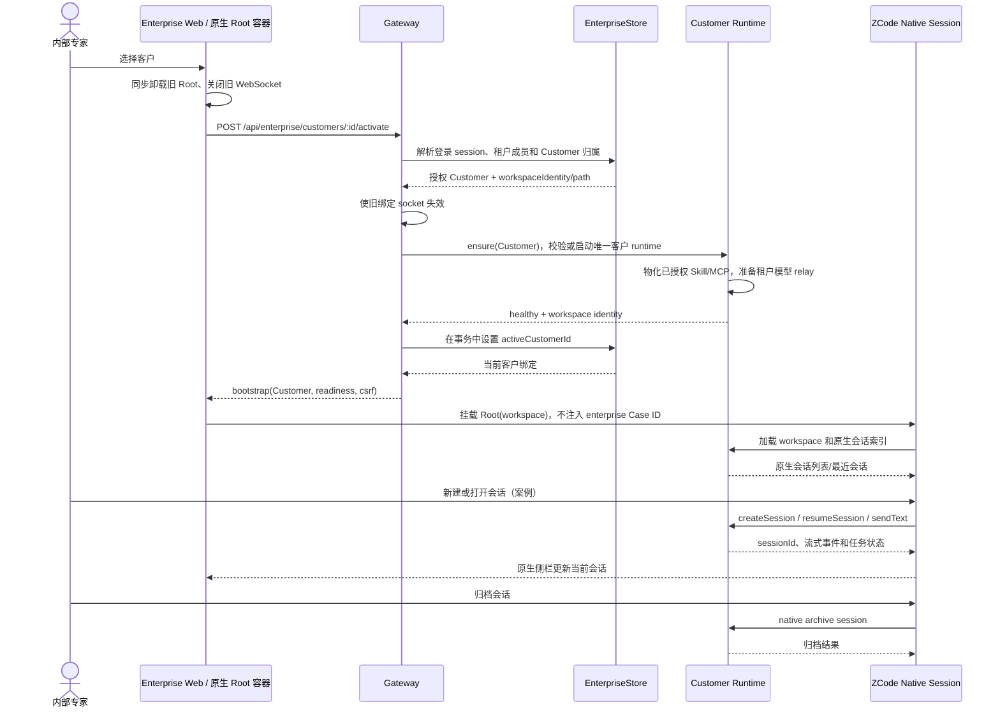

# 内部专家客户工作区 MVP 产品 spec

状态：已确认方向，供一阶段实施使用

本文定义一阶段的业务模型和边界。它细化并覆盖原有
`2026-09-29-enterprise-mvp-design.md` 与 `2026-09-30-enterprise-ux-design.md` 中与
“ServiceSpace → ServiceObject → Case → 独立 Case workspace”冲突的部分。原有文档仍可作为
现有实现和兼容迁移的参考；实现一阶段时以本文的规则为准。

## 1. 一阶段决策

一阶段只有内部专家使用平台。客户不登录、不创建账号、不访问 Web 控制台，也不拥有客户侧
权限。租户仍然是内部专家、模型凭据和数据隔离的边界。

产品模型收敛为：

```text
租户
└── 客户（一个长期 ZCode workspace）
    ├── 客户记忆和资料（workspace 文件与原生记忆）
    ├── 项目级 Skill / MCP
    └── 原生会话（产品上可称为案例）
```

必须满足以下规则：

1. 一个客户对应一个长期存在的 ZCode workspace。客户的文件、原生记忆、项目级 Skill、项目级
   MCP 和多个会话都在这个 workspace 中持续存在。
2. 一个“案例”只是一条原生 ZCode 会话的业务称呼。创建案例不再创建企业 Case 行、独立目录、
   独立运行时或对象快照；专家在当前客户 workspace 中点击原生“新建会话”即可开始一个案例。
3. 一阶段用原生会话的归档表示工作完成。归档、恢复、标题、会话内容、当前任务和历史列表均由
   ZCode 原生会话系统负责。
4. 一阶段不提供独立的 Case 状态机、负责人、结案审批、统计口径或业务结案时间。原有
   `open → in_progress → resolved → closed` 只作为旧数据的兼容信息保留，不能继续作为新流程的
   必经步骤。
5. `ServiceObject` 在新模型中收敛为 `Customer`。`ServiceSpace` 不再是用户操作概念，也不再
   作为客户和 Skill/MCP 的第二个业务层级。
6. 尽量保留 ZCode 原生 Root、workspace 文件夹式列表、会话侧栏、Composer、模式和权限交互。
   企业壳层只提供登录、授权客户选择、租户级管理入口和切换时的安全生命周期，不在聊天区旁边
   增加业务表单栏或第二套会话导航。
7. 模型配置沿用租户级企业配置。企业模式只显示管理员可配置的自定义供应商，隐藏原生 Z.ai
   用户登录、套餐、购买和个人账号配置入口；成员只能看到连接状态。供应商凭据不写入客户
   workspace、浏览器存储或会话内容。

## 2. 领域对象、状态和唯一所有者

| 对象                    | 用户含义                                 | 唯一事实来源                                                      | 一阶段边界                                                                |
| ----------------------- | ---------------------------------------- | ----------------------------------------------------------------- | ------------------------------------------------------------------------- |
| Tenant                  | 组织和访问边界                           | `EnterpriseStore`                                                 | 保留现有租户隔离和成员关系                                                |
| Membership              | 专家在租户中的角色                       | `EnterpriseStore`                                                 | 保留 `admin` / `member`，客户不成为成员                                   |
| Customer                | 被内部专家服务的客户                     | `EnterpriseStore`                                                 | 由旧 `ServiceObject` 一对一迁移而来；显示名可改，ID 和 workspace 路径不变 |
| Customer workspace      | 客户长期工作目录                         | 服务端绑定的目录 + 原生 ZCode workspace                           | 一个 Customer 只有一个；不按会话复制或重建                                |
| Native session          | 一次具体客户工作；产品标签可为“案例”     | ZCode 原生任务/会话索引和运行时                                   | 多条会话属于同一 Customer；归档由原生系统完成                             |
| Enterprise auth session | 浏览器登录和当前客户绑定                 | `EnterpriseStore`                                                 | 只保存 `activeCustomerId`，不保存业务 Case 状态                           |
| Workspace memory        | 客户长期记忆、资料和专家维护的上下文     | 客户 workspace 内的原生文件和原生记忆机制                         | 企业层不按会话生成或覆盖 `CASE_CONTEXT.md` / `AGENTS.md`                  |
| Workspace Skill         | 客户 workspace 可发现和使用的 Skill      | 原生 `.zcode/skills`；企业托管项由企业配置记录和受控物化共同管理  | 没有 ServiceSpace 共享层                                                  |
| Workspace MCP           | 客户 workspace 可使用的 MCP              | 原生 workspace 配置；企业托管连接的授权和密钥引用由企业控制面管理 | 连接只对绑定的 Customer 生效                                              |
| Tenant model credential | 租户默认模型供应商连接                   | `EnterpriseStore` 的租户凭据存储和模型 relay                      | 一次配置供该租户授权的客户 workspace 使用                                 |
| Enterprise Web state    | 登录表单、客户选择、切换进度、未提交表单 | 浏览器内存                                                        | 关闭或切换后丢弃，不冒充服务端事实                                        |

`workspaceIdentity` 用于绑定、去重、路由、缓存、队列和持久化；`workspacePath` 只用于文件操作、
命令 cwd、Git 和路径展示。身份 key 必须沿用现有规则
`workspaceIdentity?.trim() || workspacePath`。远程 workspace 继续传递现有的
`workspaceIdentity` 和 `remoteSessionId`，不能按显示名称或路径字符串自行拼接身份。

### 2.1 客户 workspace 的规则

- workspace 路径由服务端根据 Customer ID 生成，不能由浏览器提交，不能使用客户显示名作为目录名。
- 客户显示名、类型和管理元数据属于 `Customer` 记录；重命名只更新记录，不移动目录，不改变
  原生 workspace key。
- 客户 workspace 的文件和原生记忆是 Agent 后续会话的持续上下文。企业控制面不在每次启动、切换
  或新会话时覆盖用户写入的上下文文件。
- 不再生成每个 Case 的 `CASE_CONTEXT.md`，也不把一次会话的对象快照注入为下一个会话的事实。
  如果以后需要给 Agent 提供结构化客户资料，应定义一个明确的客户级文件或工具，并指定唯一
  写入者；一阶段不引入第二套记忆存储。
- Customer 不提供删除操作作为一阶段功能。若将来支持删除，必须先定义 workspace 备份、历史会话
  和 MCP 密钥撤销规则。

### 2.2 会话即案例的规则

- 专家进入 Customer 后，原生“新建会话”就是新案例；不显示单独的“创建案例”表单。
- 会话标题是案例标题的唯一来源。标题编辑沿用原生会话能力，不同步到企业数据库。
- “完成”意味着专家在原生侧栏归档该会话。归档后的会话仍属于同一 Customer，可以按原生规则恢复
  和查看历史。
- 同一 Customer 可以同时存在多个未归档会话，也可以在不同浏览器会话中被授权专家使用。企业层
  不用一个 `activeCaseId` 限制客户只能有一条会话。
- 企业网关只校验 native session 的 workspace key/path 是否属于当前 Customer；它不复制会话内容，
  也不依据 Agent 某一轮响应推断案例完成。

### 2.3 企业 Root 的任务列表来源

- Enterprise Web 当前 Root 只连接当前 Customer runtime。归档列表和会话搜索必须直接读取该 runtime
  的 `zcodeTaskService`（按 workspace identity/path 查询 tasks-index），不能依赖 Desktop 专用的窗口级
  Controller，也不能从其他 Customer runtime 拼接结果。
- 普通 ZCode Desktop 保留现有 `windowControllerService` 聚合来源，以支持窗口内多个本地/远程
  workspace；企业来源选择只在 Enterprise Root 生效，不改变普通模式的列表、搜索和远程聚合语义。
- 归档、恢复和搜索使用同一 Customer workspace key。读取失败要显示加载/错误状态并允许重试，不能
  把 Controller 不可用或 runtime 尚未就绪误报为空列表。

## 3. UX 规则

### 3.1 主路径

```text
内部专家登录
  → 选择或创建客户
  → 打开客户 workspace
  → 在 ZCode 原生会话侧栏新建/打开会话
  → 与 Agent 交互
  → 用原生归档结束该案例
```

客户选择可以使用企业入口现有的列表，也可以嵌入 ZCode 已有的 workspace 文件夹式选择器；无论
采用哪种组件，都必须满足：

- 列表展示客户名称，不能把 UUID 当作主要文案。
- 只展示当前专家有权访问的客户。
- 同一客户只出现一次，不再先选 ServiceSpace 再选 ServiceObject 再选 Case。
- 切换客户前先卸载旧 Root、关闭旧 WebSocket，再加载新 workspace；旧客户的草稿和 socket 不能
  在新客户中继续使用。
- 当前客户打开后，Root 和原生侧栏占用主要可视区域。不要在聊天上方保留两层企业 head，也不
  要在聊天左侧叠加一套 Case 列表。
- 租户切换、账号、管理员设置可以放在原生用户入口或一个紧凑的企业工具入口中；这些入口不能
  把客户、案例和用户重复显示为多层导航。
- 新建会话、归档、恢复、会话搜索、文件浏览、Skill 执行、MCP 调用、Composer 模式和权限提示
  均继续使用 ZCode 原生 UI。

### 3.2 客户设置和供应商设置

- 客户信息页只编辑名称、类型和管理元数据；名称必填，类型是可选的管理标签，未填写或填写空值时持久化为空字符串；不展示 ServiceSpace 选择器，也不要求填写案例标题。
- Skill/MCP 设置的默认作用域是当前 Customer workspace。原生 workspace 配置保留原生编辑体验；
  企业管理员配置的托管 MCP 只显示连接名称和状态，不向成员或浏览器返回密钥。
- 模型设置只允许管理员进入租户级设置。表单可复用现有 ZCode 自定义供应商字段，但企业模式隐藏
  Z.ai 登录、账号绑定、套餐余额、购买和个人 OAuth 相关入口。成员看到“已配置/未配置/不可用”
  状态和联系管理员提示。
- 供应商未配置时可以浏览客户列表和历史会话，但发送需要明确显示未配置原因。不能把原生欢迎页
  当作已经可以工作的模型配置，也不能用“跳过”掩盖不可用状态。

### 3.3 旧案例入口

迁移后主入口只显示 Customer 和新的客户 workspace。每个 Customer 下增加一个次级的“历史工作区”
入口，用于访问迁移前的 Case：

- 历史列表展示原 Case 标题、旧状态、创建时间和来源路径的安全摘要；旧状态仅供查看。
- “打开历史工作区”是明确的兼容操作。它使用原 Case 原来的 workspace path 和原生会话索引，
  因而旧会话仍可查看和继续；所有写入继续留在旧目录，不会写入新的客户 workspace。
- 历史工作区必须有明显的“历史”标识，不能与当前客户 workspace 的会话混在同一个原生列表中。
- 一阶段不提供历史 Case 状态修改、合并、复制到客户 workspace 或批量迁移内容按钮。需要把某个
  历史工作区内容带入新 workspace 时，专家只能执行明确的文件复制或后续专门迁移流程。
- 历史路径缺失、不安全或 runtime 启动失败时，显示具体错误和重试/返回客户入口，不自动创建空
  目录替代旧数据。

## 4. 客户选择、鉴权、运行时和会话顺序



事件顺序的硬约束如下：

1. Gateway 每次解析 `/ws` 和企业 API 都重新校验 cookie、成员关系和 `activeCustomerId`；不能只
   信任浏览器上一次选择的客户。
2. 激活新的 Customer 时，先使旧 WebSocket 和旧 Root 失效，再确保新 runtime，最后才提交新的
   `activeCustomerId`。在提交前不能让新请求路由到目标 workspace。
3. 新 runtime 不健康、客户配置物化失败或模型 relay 不可用时，激活不提交新绑定；Web 进入可重试
   的客户选择/过渡态，不继续显示旧 workspace 的聊天内容。
4. Root 只接收服务端授权的当前 Customer workspace。浏览器不能通过原生 `open workspace`、远程
   连接或伪造路径绕过客户选择。
5. native `sessionId` 只在原生任务索引中存在，且其 workspace key/path 与当前 Customer 完全匹配
   时才可经网关访问。企业数据库不保存第二份会话内容和状态。
6. 归档事件只由 Native 处理。Gateway 不写 Case 状态，也不因 socket 断开、Agent 返回或页面关闭
   自动归档。

## 5. 状态所有者和接口边界

### 5.1 所有者表

| 状态                                   | 写入者                                               | 读取者                          | 禁止的替代写入路径                                  |
| -------------------------------------- | ---------------------------------------------------- | ------------------------------- | --------------------------------------------------- |
| 用户、租户、成员、角色                 | `EnterpriseStore`                                    | Gateway、企业页面               | 浏览器 localStorage、Native workspace               |
| Customer 名称/类型/元数据/ID           | `EnterpriseStore`                                    | Gateway、客户选择器、运行时准备 | 从目录名反推、从会话标题反推                        |
| Customer workspace 目录绑定            | `EnterpriseStore` + Runtime adapter                  | Gateway、Native Root、文件服务  | 浏览器传任意路径、按标题创建目录                    |
| 当前浏览器的 active Customer           | `EnterpriseStore` auth session                       | Gateway、bootstrap              | React state 作为服务端事实                          |
| 原生会话内容、标题、归档、当前任务     | ZCode native task/session store                      | Native Root、受控网关           | Enterprise Case 表、Web 自建状态机                  |
| 客户 workspace 文件与原生记忆          | Native workspace/runtime                             | Agent、专家、Native UI          | 每次激活重写生成文件                                |
| Customer Skill 文件                    | Native workspace；企业托管项由企业配置和物化流程管理 | Runtime、Native Skill discovery | ServiceSpace 共享列表作为第二份事实                 |
| Customer MCP 授权、endpoint、secretRef | `EnterpriseStore` / operator secret store            | Gateway、runtime preparation    | 浏览器保存 secret、workspace 写入上游 bearer secret |
| 模型供应商凭据                         | 租户级凭据存储和 model relay                         | Gateway、runtime                | 每个会话或客户重新保存一份 key                      |
| 切换 loading、登录表单、草稿           | Enterprise Web 内存                                  | Web 组件                        | 写入 SQLite 伪装成持久业务状态                      |

### 5.2 新接口契约

以下是产品层接口；命名可按现有路由风格落地，但语义不能退回到 Case 流程。

| 接口                                                                     | 行为                                                                                                                                   |
| ------------------------------------------------------------------------ | -------------------------------------------------------------------------------------------------------------------------------------- |
| `GET /api/enterprise/bootstrap`                                          | 返回登录用户、可用租户、当前 `activeCustomer`、CSRF 和模型/运行时 readiness；不返回需要前端猜测的 Case 状态                            |
| `GET /api/enterprise/customers?tenantId=`                                | 返回当前成员可访问的 Customer 摘要，按最近使用/名称稳定排序                                                                            |
| `POST /api/enterprise/customers`                                         | 管理员或被授予创建权限的专家创建 Customer，名称必填、类型可选（空值持久化为空字符串），服务端生成唯一 workspace path；成功后可直接激活 |
| `PATCH /api/enterprise/customers/:id`                                    | 更新名称、类型和管理元数据；名称必填、类型可选（空值持久化为空字符串），不能移动 workspace、改变租户或修改历史会话                     |
| `POST /api/enterprise/customers/:id/activate`                            | 校验成员和 Customer 归属，确保 runtime，提交 `activeCustomerId`；重复调用必须幂等                                                      |
| `GET/POST /api/enterprise/customers/:id/skills`                          | 列出或发布客户级企业托管 Skill；路径必须在该 Customer workspace 的 Skill 根目录内                                                      |
| `GET/POST /api/enterprise/customers/:id/mcp-bindings`                    | 读取或管理客户级 MCP 授权；上游密钥只使用服务端 secretRef，响应不含 secret                                                             |
| `GET/PUT/DELETE /api/enterprise/tenants/:id/model-credentials/:provider` | 管理员维护租户级自定义供应商连接；企业 UI 不暴露 Z.ai 登录/套餐相关 provider                                                           |
| `/ws` 和受控 native `/api/*`                                             | Gateway 根据当前 auth session 的 `activeCustomerId` 路由到 Customer runtime；保留 ZCode 原生 RPC payload                               |
| Native session API                                                       | 由原生 `createSession`、`resumeSession`、`archiveSession` 等服务负责；不再要求 `POST /cases/:id/session` 绑定企业 Case                 |

新流程不提供 `POST /cases`、`POST /cases/:id/activate`、`PATCH /cases/:id/status` 作为必经接口。
旧接口在迁移期可以只读兼容，但不能继续创建新独立 Case workspace。现有代码中的 `nativeSessionId`
字段不能被当作新模型的客户“最后一个会话”事实；每个客户可以有多条 native session。

所有企业 mutation 继续要求 same-origin 和 CSRF。跨租户、不存在或当前成员不可见的 Customer 返回
同一 `404 not_found`，防止枚举。未登录返回 `401`，已登录但无管理权限的管理操作返回 `403`，
输入不合法返回 `400`，重复名称/幂等键冲突返回 `409`，runtime 或模型 relay 暂不可用返回 `503`。

### 5.3 创建和激活的事务边界

创建 Customer 不是普通浏览器目录创建：

1. Store 在事务中校验成员、租户和名称，生成 Customer ID 与不可变 workspace identity。
2. Runtime/file adapter 在服务端受控根目录创建真实目录并验证不是 symlink。
3. 目录准备成功后提交 Customer 记录；数据库失败时只清理本次新建且为空的目录，清理失败要记录
   可重试的 orphan，不删除已有目录。
4. 客户创建请求带稳定的幂等键时重复提交返回同一个 Customer；没有幂等键的相同名称返回冲突，
   不自动连接到已有客户。

激活 Customer 的提交顺序见上面的时序图。激活失败时旧 socket 已关闭且新的 `activeCustomerId`
不提交；Web 显示客户选择/重试页。runtime 可继续保留健康的旧客户实例供之后复用，但不能让旧
实例在新客户请求中被当作当前实例。

## 6. Runtime、Skill、MCP 和模型边界

### 6.1 Runtime

- Runtime 的逻辑 key 从 `caseId` 改为 `customerId + workspaceIdentity`。同一 Customer 的多个原生
  会话共享其长期 workspace 和客户 runtime；不同 Customer 永远不共享工作目录、HOME、任务索引
  或 relay token。
- Runtime manager 仍负责启动、健康检查、停止、陈旧实例清理和 graceful shutdown。它不保存聊天
  队列、消息快照或“案例是否完成”的事实。
- 客户切换只改变浏览器当前路由。是否立即停止旧客户 runtime 由资源策略决定；无论 runtime 是否
  保活，Gateway 每次请求都按当前 Customer 授权并校验 workspace key/path。
- Membership 被撤销时立即关闭该用户的 socket；受影响 Customer 的 runtime relay credential
  撤销，后续请求返回 `401/404`，不能等待浏览器刷新。

### 6.2 Skill

- 专家可以使用 ZCode 原生 workspace Skill。Skill 文件由该 workspace 的文件内容负责，跨会话
  持续可见。
- 企业管理员发布的托管 Skill 绑定到 Customer，而不是 ServiceSpace。物化时使用企业管理清单和
  命名空间，只更新自己托管的文件；用户创建的同名原生 Skill 触发明确冲突，不覆盖也不删除。
- 取消绑定只删除该企业托管项，不删除专家在 workspace 中创建的原生 Skill。
- Skill 内容校验、路径 realpath、hash 和 tenant/customer 授权沿用现有安全规则。

### 6.3 MCP

- Customer 级 MCP 可以来自 workspace 原生配置，也可以来自企业托管 binding。两类条目使用不同
  的命名空间，企业物化不得覆盖用户配置。
- endpoint 必须通过现有 tenant allowlist；secretRef 必须匹配租户前缀；上游 bearer secret 只在
  Gateway relay 发送请求时注入，不进入浏览器响应、Customer 文件、日志或 native shell 环境。
- Customer A 的 MCP binding 不因同一租户关系自动对 Customer B 可见。租户级旧 binding 的迁移
  复制规则见第 7 节，之后新配置必须显式绑定 Customer。
- 缺少 secret、endpoint 未允许或物化冲突时跳过该 MCP 并显示管理员诊断；普通客户聊天仍可使用，
  不能因为一个 MCP 失败而生成半配置的 workspace。

### 6.4 模型供应商

- 凭据仍由租户管理员维护；runtime 使用每个 Customer 的短期 relay capability，relay 撤销时
  旧 capability 立即失效。
- 浏览器只提交 API key 到受保护的企业接口，不在 native config、Customer workspace 或会话中
  写入明文 key。
- 自定义供应商的 `baseUrl` 只能使用 HTTPS。保存时做语法和字面地址校验；每次 relay 真实请求
  前还必须解析主机名的全部 DNS 结果，任何 loopback、私网、链路本地、共享地址、保留/文档、
  基准测试、组播或其他非公网地址都使本次请求失败，并且不能调用上游。relay 必须把通过校验的
  地址固定到实际连接，同时保留原主机名用于 TLS SNI/Host，禁止让连接阶段再次按主机名解析，
  以避免 DNS rebinding 绕过检查。
- 企业模式的可见 provider 列表只包含已支持的自定义供应商。Z.ai OAuth、个人登录、套餐/购买
  UI 和相关导航隐藏；隐藏 UI 不等于绕过后端授权，旧路由也必须在企业模式拒绝或重定向到自定义
  供应商设置。

### 6.5 企业 runtime 的 native 配置边界

- 只有企业 Customer runtime 启动时显式传入 `ZCODE_ENTERPRISE_MANAGED_MODEL=1`，才启用本节
  的 native RPC 限制。普通 ZCode Web、远程 workspace 和 Desktop continuous runtime 不受影响；
  环境变量不是浏览器可提交的开关，唯一写入者是企业 runtime adapter。
- `packages/server` 在该标记下为 native channel 注入受限 service wrapper。模型供应商配置的读取、
  模型选择读取和连通性检查可以继续使用；以下 provider settings 写入方法统一拒绝，并返回稳定
  错误码 `enterprise.model_configuration_managed`：
  `createPersonalProvider`、`savePersonalProviderOverlay`、`deletePersonalProvider`、
  `reorderPersonalProviders`、`reorderPersonalModels`、`addPersonalModel`、
  `renamePersonalModel`、`deletePersonalModel`、`savePersonalModelDraft`、
  `setPersonalModelEnabled`。
- `ISettingService.update` 仍允许 `locale`、最近项目和其他普通设置，但拒绝
  `providerFamilyDomain`、`providerFamilyConnectionSelections`、`providerFamilyDomainUpdatedAt`、
  `providerFamilyDomainMigrated` 这四个模型配置字段；`updateDataBaseDir` 也必须拒绝，因为企业
  runtime 的 HOME、数据库和运行时根目录由企业 adapter 唯一拥有，native RPC 不能改写。`get`、
  `ensureDefaultProject` 和必要的只读服务继续可用。
- 企业 runtime 的 native channel 拒绝 `IOAuthService` 的登录、轮询、回调、刷新、登出和取消等
  mutation，也不执行有迁移、登出或外部验证副作用的 `restoreCachedSession`、
  `restoreCachedSessionState`、`restoreSession`；这些恢复接口直接返回无会话结果。它同时拒绝
  `ICredentialService` 的通用 `load/save/delete`，避免隐藏 UI 后仍能通过 RPC 绕过租户管理员配置。
  普通设置（包括语言）保持可写。
- 限制只在 native RPC service 边界执行，Gateway 不解析或重写 RPC payload。验收必须同时证明：
  企业标记开启时上述写入返回稳定错误、`update({ locale })` 成功；未开启时现有 Web/远控行为不变。

## 7. v2 SQLite 无损迁移边界

用户没有授权丢弃现有 v2 SQLite 数据。迁移必须保留数据库记录、旧 workspace 目录和旧 native
session 索引；新模型和旧兼容模型可以并存一段时间。

### 7.1 映射规则

| v2 数据                             | 新模型处理                                                | 数据和目录规则                                                                                                                |
| ----------------------------------- | --------------------------------------------------------- | ----------------------------------------------------------------------------------------------------------------------------- |
| `tenants` / `users` / `memberships` | 原表继续作为事实来源                                      | 不改 ID，不降低权限，不自动邀请客户                                                                                           |
| `service_objects`                   | 每条记录建立一个同 ID 的 `customers` 记录                 | 名称、类型、metadata 复制一次；保留 `legacyServiceSpaceId` 作为迁移来源，不在主 UX 展示                                       |
| `service_spaces`                    | 保留为迁移来源/兼容查询                                   | 不再出现在新建客户和 Skill/MCP 主流程；不能把多个 ServiceSpace 合并成一个 Customer                                            |
| `cases`                             | 保留为 `legacy case` 兼容记录                             | 原 `id`、title、status、workspace path、object snapshot、native session ID 全部保留；不转换成新的客户 native session          |
| 每个旧 Case workspace               | 原路径原样保留                                            | 不重命名、不删除、不把多个目录自动复制或合并到 Customer workspace                                                             |
| `shared_skills`                     | 迁移成 Customer 级托管 Skill 的来源记录，或保留只读兼容行 | 按旧 ServiceSpace/tenant 的有效授权展开到对应 Customer；保留原 content/hash/sourceCaseId；冲突报告而不是覆盖                  |
| `mcp_bindings`                      | 迁移成 Customer 级 binding 的来源记录，或保留只读兼容行   | ServiceSpace binding 只展开到该空间已有 Customer；tenant binding 按旧语义展开到该租户的 Customer；endpoint/secretRef 重新校验 |
| `model_credentials`                 | 保持租户级                                                | 不复制到每个 Customer；继续由模型 relay 使用                                                                                  |
| auth `sessions.active_case_id`      | 迁移为 `active_customer_id`                               | 能映射到当前 Case 的 ServiceObject 时绑定其 Customer；无法映射或无权限时清空，不猜测客户                                      |

每个旧 `ServiceObject` 都是一条独立 Customer，即使名称、类型和 metadata 相同也不自动去重。需要
合并客户时必须有单独的人工合并方案；一阶段不实现。

### 7.2 新客户 workspace 与旧目录的关系

迁移为旧 Customer 创建新的服务端 workspace 目录，例如在客户 workspace 根下使用
`customers/<customerId>`。旧 Case 目录继续处于旧 Case 根下。即使一个 ServiceObject 只有一个旧 Case，
也不能把旧目录静默改名为新客户目录，因为 native task index 中的 workspace key/path 和会话历史会
因此失效。

新 Customer workspace 第一次打开时可以是空目录；专家随后在其中建立客户长期资料和新的 native
会话。旧 Case 的会话不会自动出现在新的客户会话侧栏。

### 7.3 历史工作区 UX 和运行时

- Customer 主页面的“历史工作区”列表从兼容 `cases` 读取，不提供新 Case 创建和状态流转。
- 打开历史工作区时，Gateway 使用保存的旧 workspace path、旧 native task index 和 legacy runtime
  标识启动；它不改变当前 Customer workspace 的路径，也不把历史会话绑定到新模型。
- 历史工作区可以查看和继续旧会话。若 native 运行时支持只读模式，默认可先以只读模式打开；若
  不能可靠限制写入，则界面必须明确提示“继续操作会写入历史 workspace”，并把写入限制在旧路径。
- 历史 workspace 与新 Customer workspace 使用不同 runtime key、relay token 和 session 校验。
  旧会话 ID 只能在原来的 workspace path 下通过索引校验，不能在新客户 runtime 中复用。
- 历史 Case 的旧 status 只显示为迁移前状态；一阶段不允许修改。专家需要结束新工作时归档新
  Customer workspace 中的 native session。

### 7.4 迁移失败和恢复

- Schema 迁移使用 `PRAGMA user_version`，所有表变更和映射记录在 SQLite 事务中完成；外键保持开启。
- 目录创建、realpath 和 manifest 更新不能假设与 SQLite 事务原子。迁移前写入一份 migration
  manifest，记录旧路径、新客户 ID、已完成步骤和校验结果。
- 任一旧记录无法安全映射、workspace 是 symlink、路径不存在且没有明确恢复来源时，迁移停止在
  可恢复状态：原表和原目录不动，管理员看到具体失败项。不得用空目录替换旧 workspace。
- 失败后重试必须幂等，不能重复复制 Skill、MCP 或创建第二个 Customer。新建但没有成功提交的
  空目录可清理；非空 orphan 必须保留并在 manifest 中登记，等待管理员处理。
- 迁移完成的验收条件是：每条旧 ServiceObject/Case 可追溯到一个 Customer/legacy case，旧路径
  可访问，旧 native session index 未被改写，且新客户 workspace 与所有旧 Case 目录彼此独立。

## 8. 失败行为和恢复

| 情况                                     | 服务端行为                                                         | Web 行为                                             |
| ---------------------------------------- | ------------------------------------------------------------------ | ---------------------------------------------------- |
| 未登录或 cookie 已撤销                   | `401`，不解析客户存在性                                            | 回到登录，不保留旧 Root                              |
| 跨租户/无权 Customer                     | 统一 `404 not_found`                                               | 不显示该客户，当前切换失败可重试                     |
| 客户 workspace 路径不安全或不属于绑定 ID | 拒绝激活并记 `error`，不启动 runtime                               | 显示无法打开客户 workspace，不自动修复路径           |
| runtime 启动/健康检查失败                | `503`，不提交 activeCustomer                                       | 过渡页显示重试和返回客户列表，不能停留在旧聊天界面   |
| 模型未配置或 relay 失效                  | 浏览可用；发送/模型请求 `503` 或明确 readiness 错误                | 显示联系租户管理员，不能出现可点击但无意义的发送状态 |
| Skill/MCP 单项物化失败                   | 跳过失败项并输出管理员诊断；不写半成品 secret/config               | 客户仍可聊天，设置页显示失败项和重试                 |
| Customer 名称冲突                        | `409`                                                              | 保留输入值，提示选择其他名称或打开已有客户           |
| 切换期间收到旧 socket 响应               | Gateway 丢弃旧绑定；Web 使用 generation/AbortController 丢弃旧响应 | 不能把旧会话、草稿或错误写入新客户                   |
| native 会话归档失败                      | 原生保留未归档状态；企业层不写状态                                 | 显示原生错误，可重试归档                             |
| 成员被撤销                               | 立即关闭该成员的 Customer sockets，撤销 relay capability           | 卸载 Root，显示权限失效并回登录/可用租户页           |
| 旧历史 workspace 缺失/损坏               | 保留兼容记录，返回明确 legacy error                                | 历史项标记不可用，提供返回和管理员修复提示           |

任何异步过渡都必须有成功、失败和重试路径，不允许永久“加载中”。错误日志只能记录 ID、错误
类型和必要诊断，不能记录 API key、MCP secret、会话原文、客户真实敏感资料或内部服务地址。

## 9. 验收场景

### 9.1 新模型主路径

1. 专家登录一个拥有两个租户的账号时，只看到有成员关系的租户和客户；客户不需要登录或邀请。
2. 管理员创建客户后，服务端只创建一个稳定 workspace；刷新页面仍打开同一 workspace，客户名称
   修改不会改变目录、workspace identity 或已有文件。
3. 专家打开 Customer，聊天区使用完整原生 ZCode Root，原生 workspace 文件夹显示客户名称；页面
   没有 ServiceSpace/Object/Case 三层选择，也没有重复的 Case 顶栏。
4. 专家在一个 Customer 下创建两个 native session；两个会话都能访问相同客户文件、记忆、项目
   Skill 和项目 MCP，互不覆盖草稿和会话记录。
5. 专家归档其中一个会话后，该会话从原生活动列表中归档，仍可按原生能力恢复；系统不产生 Case
   状态 API 调用，也不修改其他会话。
6. 专家切换到 Customer B 时，旧 Root/socket 先卸载；Customer B 看不到 A 的文件、native session、
   Skill、MCP relay 或模型私密信息。切回 A 后，A 的会话仍由原生索引恢复。
7. 一个 Customer 的托管 Skill/MCP 只在该 Customer runtime 中物化；另一个客户即使同属一个租户
   也不能读取其配置。MCP secret 不出现在浏览器响应、workspace 文件或日志中。
8. 租户管理员配置一次自定义供应商后，新建第二个 Customer 不需要再次输入 key；企业 UI 不出现
   Z.ai 登录、套餐或个人账号入口。撤销供应商后，所有受影响 Customer 的后续模型请求失败并可
   重试配置。

### 9.2 权限、并发和恢复

9. 成员不能读取或修改另一租户的 Customer、Skill、MCP、历史 workspace 或模型状态；响应统一为
   `404` 或按操作返回 `403`，不泄露资源是否存在。
10. 两个浏览器同时操作同一 Customer 时，各自的 auth activeCustomer 独立；共享 Customer runtime
    不导致 workspace path 或 native session 校验串线。
11. Customer 切换中 runtime 失败或成员被撤销时，页面不会继续显示旧客户聊天；刷新后可回到授权的
    客户列表并重试。
12. 页面关闭或刷新不会把 native session 自动标记为完成；重新打开 Customer 可以看到原生会话和
    归档状态。

### 9.3 v2 无损迁移

13. 一个旧 ServiceObject 下有两个旧 Case 时，迁移生成一个 Customer、两个互不合并的 legacy
    workspace 记录和一个独立的新 Customer workspace；三个目录都存在，两个旧 native session
    仍可在各自历史 workspace 中打开。
14. 迁移后旧 Case 的 status、title、object snapshot 和 native session ID 可查询；旧 status 不能
    作为新会话的可编辑业务状态，也不能强制专家先完成状态流转。
15. 旧 ServiceSpace 级 Skill/MCP 按原有有效授权展开到对应 Customer；跨 ServiceSpace 不泄漏，
    hash、来源和 secretRef 可追溯；命名冲突产生诊断而不覆盖用户内容。
16. 迁移中途模拟数据库错误、磁盘不足、symlink workspace 和缺失旧目录时，原有 SQLite 行和旧
    workspace 未被删除或改写；重试不会重复创建 Customer 或托管条目。
17. 旧历史 workspace 被明确打开时，任何继续会话的写入都留在旧目录；新 Customer workspace
    的文件和 native session 列表不因此出现隐式副本。

## 10. 实施切片和边界

建议按以下顺序落地，每个切片完成后执行对应的类型、lint、架构和目标测试：

1. **领域和迁移**：新增 Customer 映射与版本化迁移，保留旧 ServiceSpace/Case 兼容读模型，增加
   migration manifest 和失败恢复路径；先验证零数据、单旧 Case、同一对象多旧 Case 三种数据库。
2. **鉴权和路由**：把 auth session 的 active binding 从 Case 改成 Customer；Gateway、native proxy
   和 runtime manager 全部按 Customer workspace identity 校验；保留旧历史 workspace 的独立路由。
3. **运行时物化**：把 workspace、Skill、MCP 和模型 relay 的准备从 Case 改为 Customer；去除每次
   会话启动覆盖 `CASE_CONTEXT.md`/`AGENTS.md` 的行为；验证多会话共享和客户隔离。
4. **原生 Web 入口**：移除主路径上的 ServiceSpace/Object/Case 创建表单和 Case 状态 header，接入
   客户文件夹式选择并复用原生 Root/侧栏/Composer；切换时执行先卸载、后鉴权、再挂载。
5. **会话和历史**：让原生 `create/resume/archive` 成为案例生命周期唯一入口；实现历史 workspace
   的显式打开和 legacy 标识；删除新流程对 `nativeSessionId` 和企业 Case 状态的依赖。
6. **配置表面**：保留租户管理员自定义供应商配置，隐藏 Z.ai 用户登录/套餐入口；客户级 Skill/MCP
   设置使用 workspace 作用域并补齐密钥、命名冲突和撤销测试。

每个切片都必须保留无关的本地改动，并通过公开包入口和现有依赖注入边界访问平台能力。UI 不得
直接调用 Repo/Service，Runtime 不得反向依赖 Web 组件。涉及 desktop continuous 和 web remote
replayable 链路时，要分别验证持续连接和恢复后的 Customer workspace identity。

## 11. 一阶段非目标

- 客户账号、客户门户、客户可见的对话或权限。
- 独立的 Case 表、Case 状态机、结案审批、负责人、业务报表和 SLA。
- ServiceSpace 的新建、编辑、筛选和主导航；它只作为旧数据迁移来源保留。
- 自动把多个旧 Case workspace 合并成一个客户 workspace，或自动把旧会话内容复制到新 workspace。
- 新的 Agent、Session、Memory 或 RAG runtime；继续使用 ZCode 原生能力。
- SSO、计费、客户合并、跨租户共享 workspace、复杂工作流和客户级数据导出。
